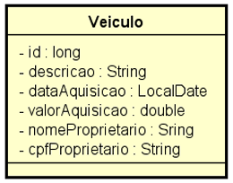

# **Projeto Revisão Java com Spring**

## 📌 Sobre o Projeto
Este projeto é uma revisão de Java com o framework Spring, contendo operações CRUD e validações essenciais.

## 🚀 Funcionalidades

### 🔹 Métodos HTTP Implementados
- **GET**: Busca por `idVeiculo`, `nomeProprietario` e `cpfProprietario`
- **POST**: Cadastro de novos veículos
- **PUT**: Atualização de dados do veículo
- **DELETE**: Remoção de veículos

### ✅ Validações Implementadas
- **CPF duplicado**: Impede a inserção de CPFs repetidos
- **Campos nulos**: Bloqueia requisições com valores ausentes
- **Campos vazios**: Garante que os dados obrigatórios sejam preenchidos

### 🗄 Banco de Dados Suportados
- **H2** (banco em memória para testes)
- **PostgreSQL** (banco de produção)

### ⚠️ Tratamento de Erros
- Retorno de mensagens amigáveis para o usuário
- Padronização de respostas HTTP para erros comuns

---

📌 **Dica:** Se sua imagem ainda não estiver carregando corretamente, copie o link direto da imagem no GitHub e substitua `classe.PNG` pelo link absoluto.  

Se precisar de mais ajustes, só avisar! 🚀😊
